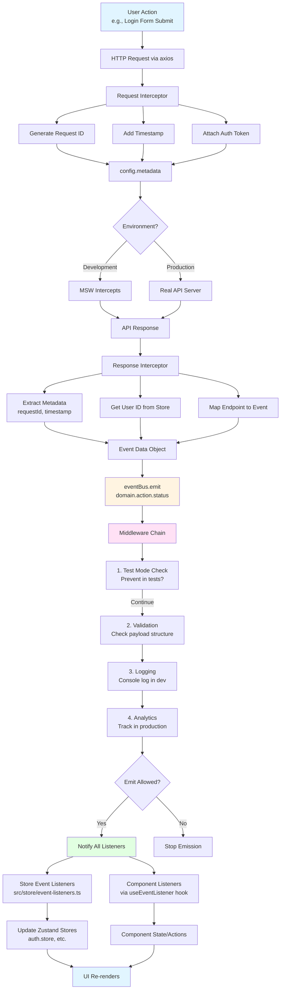
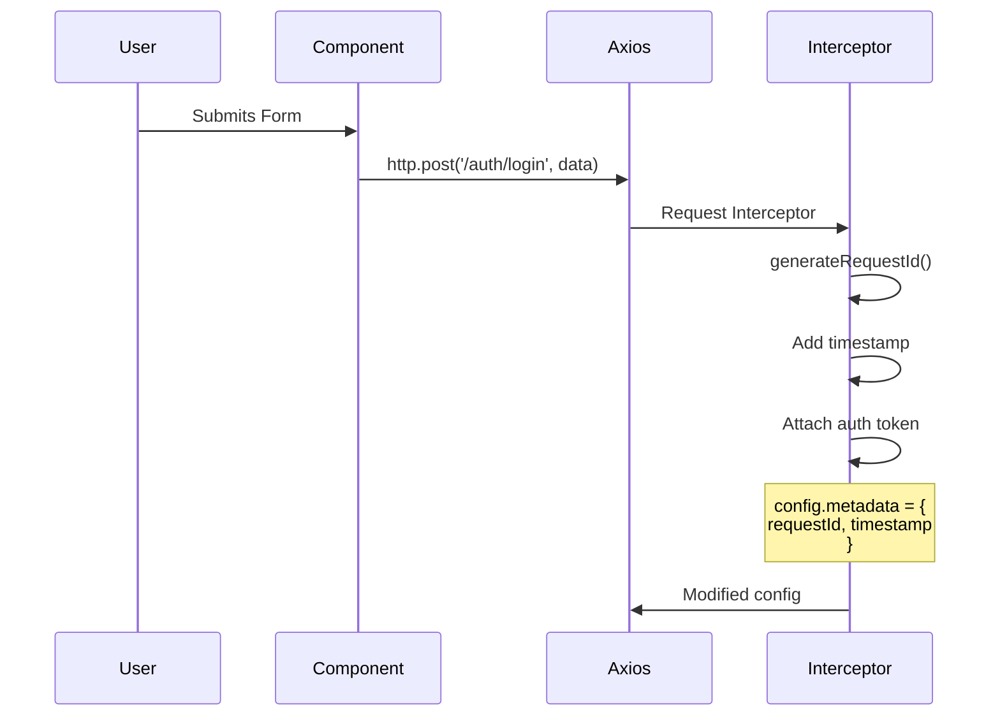
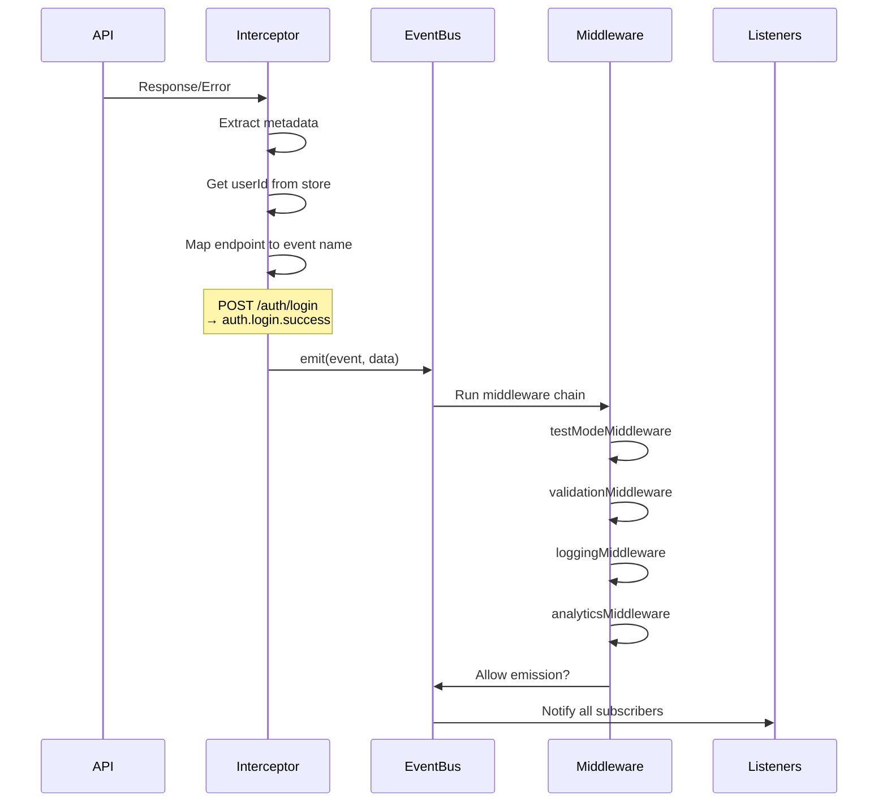
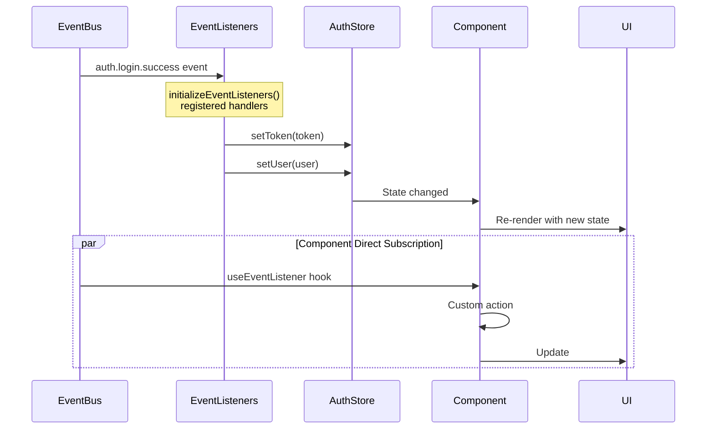

# Event System Workflow Diagram

## Complete Flow Architecture



## Detailed Component Breakdown

### 1. Request Phase


### 2. Response & Event Emission Phase


### 3. Store Update Phase


## Event Mapping Reference

### Authentication Events
| Endpoint | Method | Success Event | Error Event |
|----------|--------|---------------|-------------|
| `/auth/login` | POST | `auth.login.success` | `auth.login.error` |
| `/auth/logout` | POST | `auth.logout.success` | `auth.logout.error` |
| `/auth/me` | GET | `auth.me.loaded` | `auth.me.error` |

### Dashboard Events
| Endpoint | Method | Success Event | Error Event |
|----------|--------|---------------|-------------|
| `/dashboard/stats` | GET | `dashboard.stats.loaded` | `dashboard.stats.error` |

### User Management Events
| Endpoint | Method | Success Event | Error Event |
|----------|--------|---------------|-------------|
| `/users` | GET | `users.list.loaded` | `users.list.error` |
| `/users` | POST | `users.create.success` | `users.create.error` |
| `/users/:id` | PUT | `users.update.success` | `users.update.error` |
| `/users/:id` | DELETE | `users.delete.success` | `users.delete.error` |

## Event Data Structure

```typescript
interface BaseEventData<T> {
  payload: T              // The actual response data
  timestamp: string       // ISO 8601 timestamp
  requestId: string       // Unique request identifier (UUID)
  userId?: string         // Current user ID (if authenticated)
}

interface BaseErrorEventData<T> extends BaseEventData<T> {
  error: {
    message: string       // Error message
    status?: number       // HTTP status code
    code?: string         // Error code
    details?: any         // Additional error details
  }
}
```

## Middleware Execution Order

1. **testModeMiddleware** - Checks if running in test mode, can prevent emission
2. **validationMiddleware** - Validates payload structure, logs warnings
3. **loggingMiddleware** - Logs to console in development mode
4. **analyticsMiddleware** - Tracks events in production mode

Each middleware can:
- ✅ Transform event data
- ✅ Add side effects (logging, tracking)
- ✅ Prevent emission (return `false`)
- ✅ Continue to next middleware (call `next()`)

## Usage Examples

### In Components (Subscribe to Events)
```tsx
import { useEventListener } from '@/hooks/useEventListener'

function MyComponent() {
  useEventListener('auth.login.success', (data) => {
    console.log('User logged in:', data.payload.user)
    // Custom component logic
  })
  
  return <div>...</div>
}
```

### In Stores (Centralized Updates)
```typescript
// src/store/event-listeners.ts
export function initializeEventListeners() {
  eventBus.on('auth.login.success', (data) => {
    const { setUser, setToken } = useAuthStore.getState()
    setToken(data.payload.token)
    setUser(data.payload.user)
  })
  
  // More event handlers...
}
```

### Adding Custom Middleware
```typescript
import { eventBus } from '@/lib/eventBus'
import type { EventMiddleware } from '@/types/events'

const customMiddleware: EventMiddleware = (event, data, next) => {
  // Your custom logic
  console.log('Custom middleware:', event)
  
  // Continue to next middleware
  next()
  
  // Or prevent emission
  // return false
}

eventBus.use(customMiddleware)
```

## Key Benefits

1. **🎯 Centralized Event Handling** - All API events flow through one system
2. **🔍 Request Tracking** - Every request has a unique ID for debugging
3. **🧩 Extensible** - Add middleware for logging, analytics, validation
4. **🔄 Decoupled** - Components don't need to know about store updates
5. **🏭 Production Ready** - Works with both MSW mocks and real APIs
6. **📊 Analytics Ready** - Built-in analytics middleware
7. **🧪 Test Friendly** - Can disable events in test mode
8. **⚡ Type Safe** - Full TypeScript support with strict event types

## Files Reference

- **Event Types**: `src/types/events.ts`
- **Event Bus**: `src/lib/eventBus.ts`
- **HTTP Integration**: `src/lib/http.ts`
- **React Hook**: `src/hooks/useEventListener.ts`
- **Store Listeners**: `src/store/event-listeners.ts`
- **Middlewares**: `src/lib/middlewares/`
- **Initialization**: `src/main.tsx`
